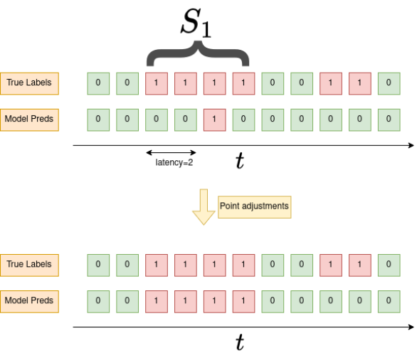
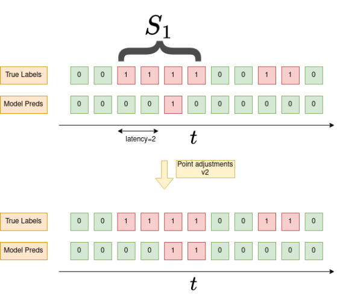

# Unofficial Implementation of Anomaly Detection in Streaming Data with Extreme Value Theory + Utility Functions for Time Series Anomaly Detection Analysis  


🔗 **Paper:** [Anomaly Detection in Streams with Extreme Value Theory](https://hal.science/hal-01640325/)  

This repository provides an implementation of the **SPOT** and **DSPOT** algorithms from the paper *Anomaly Detection in Streams with Extreme Value Theory*.

## 📌 About  

The implementation is heavily based on the original code by:  

```python
"""
Created on Mon Dec 12 10:08:16 2016

@author: Alban Siffer
@company: Amossys
@license: GNU GPLv3
"""
```

## 🛠️ Code Structure  

- **`pot.py`** – Contains the implementation of SPOT and DSPOT algorithms.  
- **`experiments.ipynb`** – A Jupyter notebook showcasing experiments on both **stationary** and **non-stationary** streaming data.  

## 🎯 Use Case  

This method is useful for anomaly detection in streaming data, and it has been particularly helpful in my thesis research on this topic.  

## ⚙️ Additional Utility Functions  

This repository also includes supplementary functions for evaluating anomaly detection performance on time series data.  

### 📏 `metric_utils.py` – Evaluation Metrics  

This module provides an enhanced version of the **Point Adjustment Method** for adjusting detection in anomaly periods with the latencies.  

#### 🔹 **Point Adjustment Method:**  
If an anomaly is detected within an anomaly period, the entire anomaly period is considered detected.  
<p align="center">
  
</p>

#### 🔹 **Modified Point Adjustment Method:**  
If an anomaly is detected within an anomaly period, all subsequent anomalies within the same period are also considered detected.  
<p align="center">
  
</p>